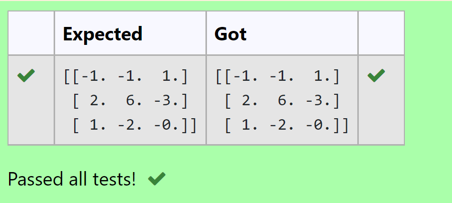

# INVERSE-OF-A-MATRIX:

## AIM:
To write a python program to find the inverse of a matrix

## EQUIPMENT'S REQUIRED:
1. 	Hardware – PCs
2. 	Anaconda – Python 3.7 Installation / Moodle-Code Runner

## ALGORITHM:
### Step1:
Import numpy as np.
### Step 2: 
Assign np.array() in inverse of a matrix.
### Step 3: 
Using the np.linalg.inv() we can find the inverse of a matrix.
### Step 4:
Add the coding and end the program. 

## PROGRAM:
```
#Program to find the inverse of a matrix.
#Developed by: Aashima Nazreen Sayeed S
#RegisterNumber: 21500368
import numpy as np
A = np.array([[6,2,3],[3,1,1],[10,3,4]])
values = np.linalg.inv(A)
print(values)
```

## OUTPUT:



## RESULT:
Thus the inverse of given matrix is successfully solved using python program

